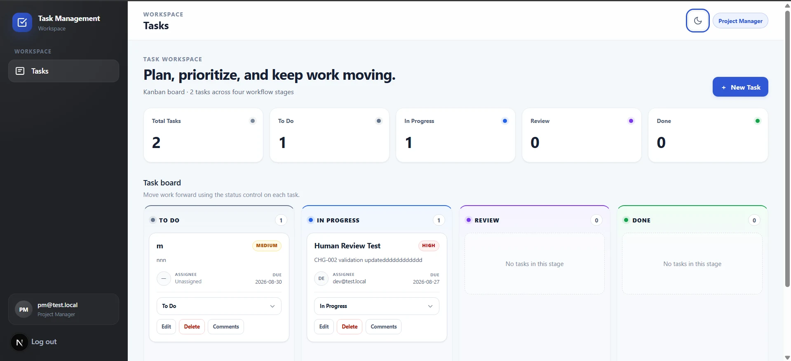
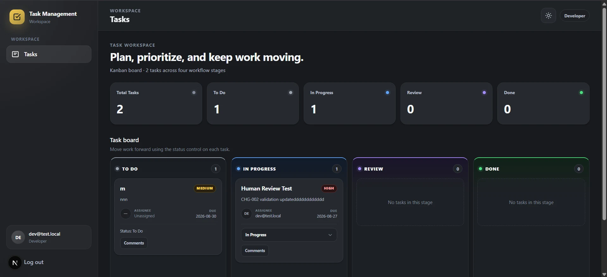

# Task Management App

A full-stack task management application designed for a small software team.

Project Managers can create, assign, edit, delete, and track tasks through a four-column Kanban workflow. Developers can view tasks, comment on them, and update the status of tasks assigned to them.

The application includes role-based access control, server-side authentication, CSRF protection, responsive layouts, and persistent light/dark themes.

## Development Process

This application was developed as the reference software product for my first-year Engineering Cycle internship project, the [Digital Factory](https://github.com/ayuuOub/digital-factory), in Digital Transformation and Artificial Intelligence at ENSA Al Hoceima.

The Digital Factory is a governed, LLM-powered multi-agent software-delivery system operated through Hermes Agent. Specialized agent profiles were used across product analysis, UI/UX, architecture, security, development, independent QA/browser validation, and documentation, with Human-in-the-loop approval gates controlling progression through the workflow.

Hermes and the LLM-backed agents were part of the **development workflow only**. The Task Management App itself runs independently and does not require Hermes or an LLM at runtime.

```text
Development
-----------
Hermes + LLM-backed agents
          ↓
Digital Factory
          ↓
Task Management App

Runtime
-------
Browser
   ↓
Next.js
   ↓
FastAPI
   ↓
MySQL
```

## Screenshots

### Project Manager Workspace



The Project Manager view provides full task-management controls, including task creation, editing, deletion, assignment, status updates, and comments.

### Developer Workspace



The Developer view exposes the shared Kanban workflow while restricting management actions according to the application's role-based access-control model.

## Features

### Project Manager

- Create, edit, delete, assign, and prioritize tasks
- Set due dates and update task status
- View and add comments
- View task counts across the Kanban workflow

### Developer

- View tasks and assignees
- Update the status of assigned tasks
- View and add comments
- No access to task creation, editing, or deletion

### Workflow

```text
To Do -> In Progress -> Review -> Done
```

Each task can include a title, description, assignee, priority, status, due date, and comments.

### Interface

- Responsive task dashboard
- Four-column Kanban board
- Task summary counters
- Priority, assignee, and due-date information
- Light mode
- Dark mode
- Persistent theme preference

## Technology Stack

| Layer | Technology |
|---|---|
| Frontend | Next.js 15.5.24, React 19, TypeScript |
| Backend | FastAPI, SQLAlchemy 2, Alembic, Python 3.11 |
| Database | MySQL 8 |
| Authentication | Argon2id, server-side sessions, HttpOnly cookies |
| Request Security | Session-bound CSRF synchronizer token, Origin/Referer validation |
| Authorization | Server-side role-based access control |
| Infrastructure | Docker Compose |

## Architecture

```text
Browser
   |
   v
Next.js Frontend
   |
   v
FastAPI REST API
   |
   v
SQLAlchemy
   |
   v
MySQL 8
```

Authentication and authorization are enforced by the backend. Frontend role-based controls are used for usability, while the backend remains the authoritative security boundary.

## Documentation

| Document | Contents |
|---|---|
| [docs/01-product-overview.md](docs/01-product-overview.md) | Product scope, roles, and task model |
| [docs/02-architecture.md](docs/02-architecture.md) | Runtime architecture and data flow |
| [docs/03-api-reference.md](docs/03-api-reference.md) | API reference |
| [docs/04-authentication-security.md](docs/04-authentication-security.md) | Sessions, cookies, CSRF, and security controls |
| [docs/05-authorization-rbac.md](docs/05-authorization-rbac.md) | Project Manager / Developer permission matrix |
| [docs/06-testing-validation.md](docs/06-testing-validation.md) | Test suites and validation evidence |
| [docs/07-deployment-operations.md](docs/07-deployment-operations.md) | Local development and deployment guidance |
| [docs/08-known-limitations.md](docs/08-known-limitations.md) | Known limitations |

## Quick Start

From the repository root:

```bash
cp .env.example .env
docker compose up --build -d
```

Default local services:

```text
Frontend:      http://localhost:3000
Backend API:   http://localhost:8000
API health:    http://localhost:8000/api/health
OpenAPI docs:  http://localhost:8000/docs
MySQL:         localhost:${MYSQL_HOST_PORT:-33061}
```

Do not commit local `.env` files.

## Backend Development

```bash
cd backend
python -m venv .venv
pip install -r requirements.txt -r requirements-dev.txt
cp .env.example .env
alembic upgrade head
uvicorn app.main:app --reload --port 8000
```

Activate the virtual environment using the appropriate command for your operating system before installing dependencies.

## Frontend Development

```bash
cd frontend
npm ci
npm run dev
```

Production build:

```bash
npm run build
npm run start
```

On Windows PowerShell systems where `npm.ps1` is blocked by execution policy, use `npm.cmd`, for example:

```powershell
npm.cmd run dev
```

## Tests

Backend regression suite:

```bash
cd backend
pytest
```

Frontend test suites are located under:

```text
frontend/tests/
```

See [docs/06-testing-validation.md](docs/06-testing-validation.md) for additional validation details.

## Security

The application includes:

- Argon2id password hashing
- Opaque server-side sessions
- HttpOnly session cookies
- Session-bound CSRF protection
- Origin/Referer validation
- Server-side role-based access control
- Generic authentication error responses
- Login rate limiting
- Environment-based configuration
- No committed runtime secrets

Local credentials and secrets belong only in `.env` files derived from the provided `.env.example` templates.

## Dependency Security

The frontend currently uses:

```text
Next.js: 15.5.24
PostCSS: 8.5.26
Sharp:   0.35.4
```

PostCSS and Sharp are pinned through npm overrides to patched versions compatible with the current frontend.

Current local audit results:

```text
npm audit
found 0 vulnerabilities

npm audit --omit=dev
found 0 vulnerabilities
```

## Repository Structure

```text
task-management-app/
|
+-- backend/
|   +-- app/
|   +-- migrations/
|   +-- tests/
|   `-- Dockerfile
|
+-- frontend/
|   +-- app/
|   +-- lib/
|   +-- tests/
|   +-- package.json
|   `-- package-lock.json
|
+-- infrastructure/
+-- docs/
+-- .env.example
+-- docker-compose.yml
`-- README.md
```

## Current Local Validation

The current application state has been locally validated with:

- Frontend production build: PASS
- ESLint: 0 errors
- npm audit: 0 known vulnerabilities
- npm production dependency audit: 0 known vulnerabilities
- Project Manager task creation: PASS
- Project Manager task editing: PASS
- Project Manager task deletion: PASS
- Project Manager status update: PASS
- Developer assigned-task status update: PASS
- Comments workflow: PASS
- Priority rendering: PASS
- Light theme: PASS
- Dark theme: PASS
- Theme persistence: PASS

The ESLint run currently reports warnings in existing frontend test files, but no lint errors.

## Known Limitations

See [docs/08-known-limitations.md](docs/08-known-limitations.md).

## Deployment Note

Docker Compose is intended primarily for local development.

For production, the frontend and backend API should use production environment settings behind an appropriate reverse proxy. The intended topology is same-origin, with the frontend and API exposed through the same origin.

Development servers such as `next dev` must not be used as the production runtime.

See [docs/07-deployment-operations.md](docs/07-deployment-operations.md) for deployment and operational guidance.
