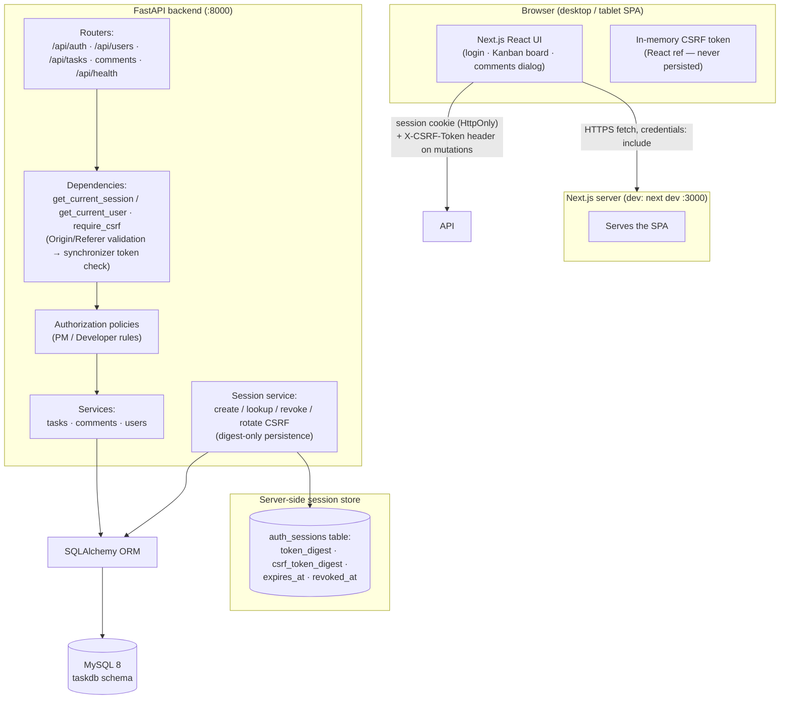
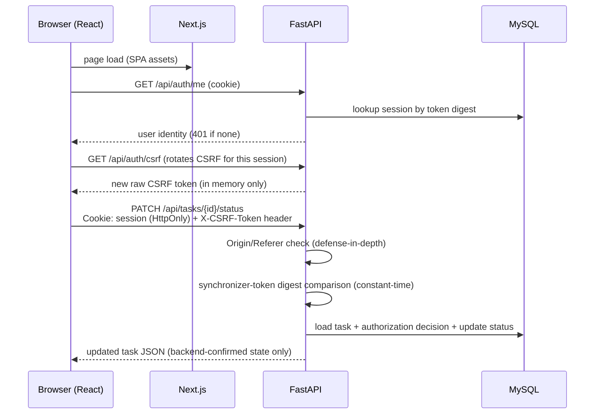

# 02 — Architecture

> **Scope note:** this document describes the *product* runtime of the Task
> Management MVP. It is unrelated to any external agent/orchestration tooling
> that may have been used to build it.

## 1. Implemented stack (verified in repository)

| Layer | Technology | Version pin / evidence |
|---|---|---|
| Frontend | Next.js (App Router) + React + TypeScript | `frontend/package.json`: `next 15.5.23`, `react 19.1.0`, TypeScript ^5 |
| Backend | FastAPI + Uvicorn (Python 3.11 image) | `backend/requirements.txt`: `fastapi 0.115.12`, `uvicorn 0.34.0` |
| ORM / migrations | SQLAlchemy 2.0 + Alembic | `SQLAlchemy 2.0.40`, `alembic 1.15.2` |
| Database | MySQL 8 (InnoDB, utf8mb4) | `docker-compose.yml`: `mysql:8.4` |
| Password hashing | Argon2id via argon2-cffi | `argon2-cffi 23.1.0` |
| Local infra | Docker Compose (db + backend + frontend) | repo-root `docker-compose.yml` |

## 2. Runtime topology

Data flow of an authenticated mutation (e.g. status change):

## 3. Component responsibilities

### Frontend (`frontend/`)
- `app/page.tsx` — renders login form or authenticated shell/board based on auth state.
- `lib/auth-context.tsx` — centralized auth provider. Session existence probed via
  `GET /api/auth/me`; CSRF token refreshed via `GET /api/auth/csrf` into a React ref.
  The raw token lives **only in runtime memory**; nothing is written to
  `localStorage`, `sessionStorage`, IndexedDB or `document.cookie`.
- `lib/api.ts` — single `fetch` wrapper (`credentials: "include"`, sanitized errors,
  attaches `X-CSRF-Token` to non-GET requests only). No other module calls `fetch`.
- `lib/tasks-api.ts` — typed functions mirroring the backend endpoints exactly.
- `app/task-board.tsx` — four-column Kanban; role-gated controls; every board
  update comes from the backend-confirmed response (no optimistic fake state).
- `app/comments-panel.tsx` — accessible comments dialog (`role="dialog"`,
  Escape closes, overlay click closes); no edit/delete/moderation controls.

### Backend (`backend/app/`)
- `main.py` — application factory. Registers routers, CORS middleware
  (wildcard origin is rejected at startup), the strict-validation handler
  (unknown fields on mutating methods → HTTP 400; other validation → HTTP 422;
  sanitized bodies only), and the central `AuthorizationDenied → 403` handler.
- `auth/security.py` — Argon2id hashing/verification plus the constant dummy-hash
  verification used for unknown emails.
- `auth/session_service.py` + `auth/session_model.py` — creation, digest-only
  lookup, revocation and CSRF rotation of server-side sessions
  (`auth_sessions` infrastructure table).
- `auth/dependencies.py` — `get_current_session` / `get_current_user`
  (authentication → 401) and `require_csrf` (Origin/Referer check first,
  then constant-time synchronizer-token digest compare → 403).
- `auth/origin_validation.py` — centralized Origin/Referer defense-in-depth
  (SEC-MED-01): exact normalized-origin matching against the same allowlist
  used for CORS; fail-closed Host fallback when no allowlist is configured.
- `auth/rate_limit.py` — optional login throttle (in-process prototype).
- `auth/authorization.py` — the ONLY place role rules live (Phase 3B policies).
- `api/routes/*` + `services/*` — thin routes over service layers that call
  authorization policies before touching data.
- `models/*` — User, Task, Comment domain tables + `AuthSession` infrastructure table.
- `schemas/*` — strict Pydantic request schemas (`extra="forbid"`) and minimal response schemas.

### Database (MySQL)
Two Alembic revisions, linear:
1. `2d80cdb002f4` — creates `users`, `tasks`, `comments` (CHECK constraints on
   role/status/priority values; FK `tasks.assignee_id → users.id ON DELETE SET NULL`;
   FK `comments.task_id → tasks.id ON DELETE CASCADE`; FK `comments.user_id → users.id ON DELETE RESTRICT`).
2. `29fac519f35f` — adds `auth_sessions` (infrastructure/security state).

Deleting a task cascades its comments at the database level. Deleting a user
sets their tasks' `assignee_id` to NULL.

## 4. Cross-cutting design rules

- **Backend authority:** identity, role, ownership and timestamps are always
  loaded server-side; client-supplied claims are never consulted.
- **Fail closed:** unapproved roles get nothing; missing/unknown/expired/revoked
  sessions are indistinguishable (all → generic 401); malformed Origin/Referer
  presentation → 403 with a generic body.
- **Sanitization:** error responses never echo submitted input, internal reason
  strings, identifiers, tokens, or header values. Security logs contain event
  names and non-sensitive facts only.
